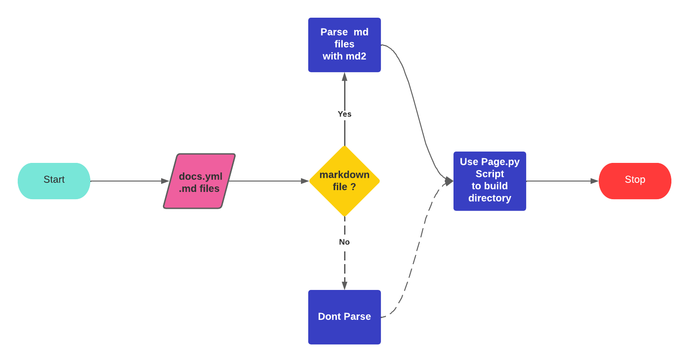

# GENOMICS DATA COMMON DOCUMENTATION APP V2

## What is the GDC?

A free, open-source system called the Genomic Data Commons (GDC) provides standardised cancer genomic data to researchers all around the world. The GDC documentation website now offers further background knowledge and user manuals.

## About The Project

The GDC docs Revamp project is based on an object oriented python script which uses the Jinja templating engine to write markdown file content to HTML templates, and build them to a static site directory.
This workflow is used by the new site generator to create the documentation website:

1. The user creates a yaml configuration file which contains the directory structure of the documentation site.

   - The yaml configuration file contains the path to css files, js files, and the path to the markdown files.
   - The yaml configuration file also contains path to any other file to be included in the documentation.

2. The user runs the setup.py script which parses the yaml configuration file and creates the documentation site directory.
3. The user runs the startserver.py script which starts a local server and serves the documentation site.

## Use Case

By integrating the above transformation process, one can convert the markdown files into HTML files that can be rendered by web servers, making it easier for non-technical people to work with.

## Pre-Coding

In addition to being acquainted with the project, I explored the Mkdocs, Jinja, and Markdown Packages, where I gained technical knowledge on how to develop a static site generator.
I additionally looked at the features of various non-Python site builders.
If you would like to know more about non python site generators , check [Here](https://www.fullstackpython.com/static-site-generator.html)

## The Journey

After the community bonding phase, I had learned a lot from my mentor, and it was time to get my hands dirty.
During the first week, I attempted to create a simple framework that replicated the capabilities of the existing site generator (mkdocs).
The URL to the practice project is available [Here](https://github.com/AsyncDeveloper245/gdc docs practice)

The second week was spent developing a new site generator capable of parsing markdown files and constructing the documentation site. Several issues arose this week that I needed to overcome before the site generator could function on the GDC Directory structure.

### Challenge-1: Going Through Directories and Sub-Directories is there are any.

### Challenge-2: Navigation Bar and Sidebar

### Challenge-3: Site Linking

### Challenge-4: Adding Icons and PDFs

## Results

## Current Standing

Currently, the GDC Site Generator can do the following:

1. Convert Markdown files to HTML files.
2. Read the YAML configuration file and create the documentation site directory.
3. Use the Jinja templating engine to pass context varies between different templates.
4. Use the BautifulSoup to Create a navigation bar and sidebar.
5. Integrate a third party API to create the GDC dictionary viewer.
