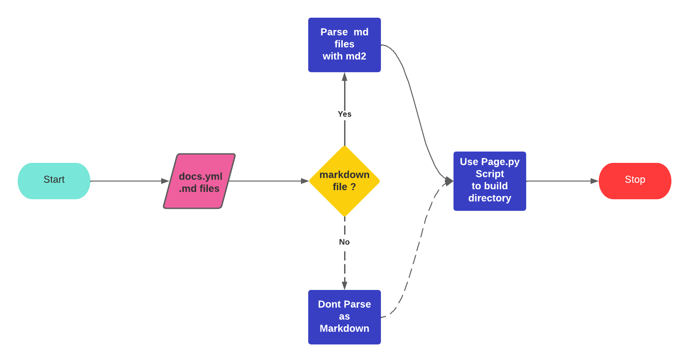

# GENOMICS DATA COMMON DOCUMENTATION APP V2

## What is the GDC?

A free, open-source system called the Genomic Data Commons (GDC) provides standardised cancer genomic data to researchers all around the world. The GDC documentation website now offers further background knowledge and user manuals.

## About The Project

The GDC docs Revamp project is based on an object oriented python script which uses the Jinja templating engine to write markdown file content to HTML templates, and build them to a static site directory.
This workflow is used by the new site generator to create the documentation website:

1. The user creates a yaml configuration file which contains the directory structure of the documentation site.

   - The yaml configuration file contains the path to css files, js files, and the path to the markdown files.
   - The yaml configuration file also contains path to any other file to be included in the documentation.

2. The user runs the setup.py script which parses the yaml configuration file and creates the documentation site directory.
3. The user runs the startserver.py script which starts a local server and serves the documentation site.

## Use Case

By integrating the above transformation process, one can convert the markdown files into HTML files that can be rendered by web servers, making it easier for non-technical people to work with.

## Pre-Coding

In addition to being acquainted with the project, I explored the Mkdocs, Jinja, and Markdown Packages, where I gained technical knowledge on how to develop a static site generator.
I additionally looked at the features of various non-Python site builders.
If you would like to know more about non python site generators , check [Here](https://www.fullstackpython.com/static-site-generator.html)

## The Journey

After the community bonding phase, I had learned a lot from my mentor, and it was time to get my hands dirty.
During the first week, I attempted to create a simple framework that replicated the capabilities of the existing site generator (mkdocs).
The URL to the practice project is available [Here](https://github.com/AsyncDeveloper245/gdc_docs_practice)

The second week was spent developing a new site generator capable of parsing markdown files and constructing the documentation site. Several issues arose this week that I needed to overcome before the site generator could function on the GDC Directory structure.

### Challenge-1: Navigation Bar and Sidebar

When it came time to developing the sidebar and navigation bar after working on some other project components, I ran into a bottleneck since I believed there was no way I could leverage the parsed directory structure to construct a sidebar and navigation bar.
The issue is that in order to generate the sidebar and navigation bar, the Sidebar has to use the directory structure that was given and take into account any related pages and anchor references on each page.

**Solution:** To make the sidebar function, I added a function that creates sibling pages and also modifies the html files while adding the sidebar using the Python BeautifulSoup module.

### Challenge-2: Adding Icons and PDFs

The format of pdf files is "fa-file-pdf-o Download PDF /API/PDF/API UG.pdf." As a result, the python script simply creates the entire directory and names the pdf directory "fa-file-pdf-o Download PDF /API/PDF/API UG." It also uses the output from the above command in place of the Download PDF button in nav bars.

**Solution:** To solve this issue, I changed the Python script to recognize pdf files and process them differently from markdown files.

## Results

## Current Standing

Currently, the GDC Site Generator can do the following:

1. Convert Markdown files to HTML files.
2. Read the YAML configuration file and create the documentation site directory.
3. Use the Jinja templating engine to pass context varies between different templates.
4. Use the BeautifulSoup to Create a navigation bar and sidebar.
5. Integrate a third party API to create the GDC dictionary viewer.

## Future Goals

The site generator appears to have a promising future. There are still a few parts that need some further development. Among them are:

- Create parsers for various input kinds by modifying the Python script to parse input based on file type.
- Make code chunks available for testing by users on documentation pages.
- Alter script to properly parse static (image) files
- Instead of relying on the pre-existing files in the templates directory, let users use their own basic templates.

## My Experience

I enjoyed my experience with GSoC. This summer, working on the project allowed me to gain a lot of knowledge. From someone who didn't know much about static site generators (and didn't use them much) to someone who has developed a site generator and understands the technical aspects of how they operate. I want to thank Bill, my mentor, as well as Jacob for assisting me anytime I ran into problems or was unsure on how to approach a subject. Additionally, I would want to thank the Center for Translational Data Science, Chicago community for giving me the chance to collaborate with them and for assisting me in better understanding the ecosystem and how it functions.

In the future, I'd like to help the GDC Documentation Project by enhancing the services they provide, either by coding or by offering suggestions. As I transfer the torch to the successors, I will also assist those who want to contribute to the GDC Documentation Project by explaining things and the environment. In the end, GSoC is only the start.
