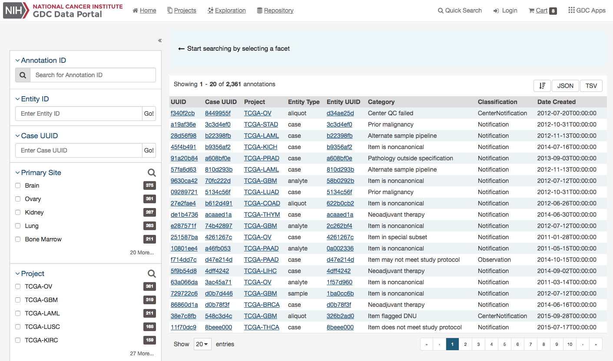

# Annotations

Annotations are notes added to individual cases, samples or files.

## Annotations View

The Annotations View provides an overview of the available annotations and allows users to browse and filter the annotations based on a number of annotation properties (facets), such as the type of entity the annotation is attached to or the annotation category.

The view presents a list of annotations in tabular format on the right, and a facet panel on the left that allows users to filter the annotations displayed in the table. If facet filters are applied, the tabs on the right will display only the matching annotations. If no filters are applied, the tabs on the right will display information about all available data.

Clicking on an annotation ID in the annotations list will take the user to the [Annotation Detail Page](#annotation-detail-page).

### Facets Panel

The following facets are available to search for annotations:

- **Annotation ID**: Seach using annotation ID
- **Entity ID**: Seach using entity ID
- **Case UUID**: Seach using case UUID
- **Primary Site**: Anatomical site of the cancer
- **Project**: A cancer research project, typically part of a larger cancer research program
- **Entity Type**: The type of entity the annotation is associated with: Patient, Sample, Portion, Slide, Analyte, Aliquot
- **Annotation Category**: Search by annotation category.
- **Annotation Created**: Search for annotations by date of creation.
- **Annotation Classification**: Search by annotation classification.

#### Annotation Categories and Classification

For more details about categories and classifications please refer to the [TCGA Annotations page on NCI Wiki](https://wiki.nci.nih.gov/display/TCGA/Introduction+to+Annotations).

## Annotation Detail Page

The annotation entity page provides more details about a specific annotation. It is available by clicking on an annotation ID in Annotations View.

